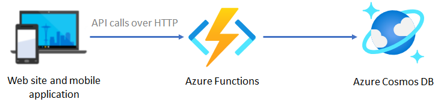

# チャレンジ 2 - Cosmos DB and Azure Functions

Best For You Organics Company (BFYOC) は、商品情報の作成と取得、およびユーザーがフィードバックできる機能をモバイルおよび Web で提供することにしました。モバイルアプリと Web は同じバックエンド API を利用します。

BFYOC は開発者であるあなたに、商品情報の保存と取得ができる API の開発を依頼してきました。



この図は、モバイルアプリと Web クライアントが [Azure Functions](https://azure.microsoft.com/ja-jp/services/functions/) で公開された API を経由して、[Cosmos DB](https://docs.microsoft.com/ja-jp/azure/cosmos-db/) へデータ保存したり取得を行う様子を示しています。

## チャレンジ

### Cosmos DB インスタンスの作成

BFYOC の商品を保存できるよう、Cosmos DB の作成と構成を行います。

- [Azure Functions 2.x の Azure Cosmos DB バインド](https://docs.microsoft.com/ja-jp/azure/azure-functions/functions-bindings-cosmosdb-v2) の詳細を確認
- SQL API を指定して Cosmos DB を作成
- コンテナの partition key は `/productId` を指定

### API の作成

このチャレンジでは、以下 3 つの関数を開発してデプロイします。

- **CreateProduct**

  - **HTTP Verb**: POST
  - **インプットペイロードのサンプル**:

      ```JSON
      {
          "productId": "75542e38-563f-436f-adeb-f426f1dabb5c",
          "productName": "Starfruit Explosion",
          "productDescription": "This starfruit ice cream is out of this world!"
      }
      ```

  - **要件**

    - `timestamp` プロパティにレコード作成時点の UTC 時刻を保持
    - Cosmos DB に商品情報を保存
    - 応答には作成した商品と追加された `timestamp` を返す
    例:

      ```JSON
      {
        "productId": "75542e38-563f-436f-adeb-f426f1dabb5c",
        "productName": "Starfruit Explosion",
        "productDescription": "This starfruit ice cream is out of this world!",
        "timestamp": "2019-09-14 21:27:47Z"
      }
      ```

- **GetProduct**

  - [チャレンジ 1](..//Chanllenge1-Azure-Function-Basics/readme.md) で作成した関数を拡張
  - **HTTP Verb**: GET
  - **クエリーストリングまたはパラメーター**: `productId`
  - **要件**

    - 以下のようにデータベースより商品情報を応答として返す:

        ```JSON
        {
          "productId": "75542e38-563f-436f-adeb-f426f1dabb5c",
          "productName": "Starfruit Explosion",
          "productDescription": "This starfruit ice cream is out of this world!",
          "timestamp": "2019-09-14 21:27:47Z"
        }
        ```

- **GetProducts**

  - **HTTP Verb**: GET
  - **要件**

    - 全商品の情報を JSON ペイロードとして返す:

        ```JSON
        [
          {
              "productId": "75542e38-563f-436f-adeb-f426f1dabb5c",
              "productName": "Starfruit Explosion",
              "productDescription": "This starfruit ice cream is out of this world!",
              "timestamp": "2019-09-14 21:27:47Z"
          },
          {
              "productId": "e94d85bc-7bd0-44f3-854e-d8cd70348b63",
              "productName": "Tropical Mango",
              "productDescription": "You know what they say... It takes two.  You.  And this ice cream.",
              "timestamp": "2019-09-14 21:27:47Z"
          }
        ]
        ```

## 達成条件

- 3 つの関数をすべて Azure にデプロイしてテストを行う。テストには [cURL](https://curl.haxx.se/) や [Postman](https://www.getpostman.com/) を利用する。
- エンドポイントで適切な HTTP ステータスコードを返す。例えば存在しない商品を検索した場合は、404 を返す。

## 参照情報

- [Azure Functions でのトリガーとバインドの概念](https://docs.microsoft.com/ja-jp/azure/azure-functions/functions-triggers-bindings)
- [Azure Cosmos DB の概要](https://docs.microsoft.com/ja-jp/azure/cosmos-db/introduction)
- [Azure Functions 2.x の Azure Cosmos DB バインド](https://docs.microsoft.com/ja-jp/azure/azure-functions/functions-bindings-cosmosdb-v2)
- [Azure Functions のトリガーとバインド](https://docs.microsoft.com/ja-jp/azure/azure-functions/functions-bindings-http-webhook)
- [Azure Functions と Azure Cosmos DB を使用して非構造化データを格納する](https://docs.microsoft.com/ja-jp/azure/azure-functions/functions-integrate-store-unstructured-data-cosmosdb)
- [Cosmos DB (DocumentDB) Bindings(英語)](https://docs.microsoft.com/en-us/sandbox/functions-recipes/cosmos-db?tabs=csharp)

## 次のチャレンジ

このチャレンジが完了したら、次のチャレンジは以下より選択:

1. 次のチャレンジである [Logic Apps](..//challenge-3-Logic-Apps/readme.md) に進む。

1. 本チャレンジの代替え手段を模索する `チャレンジ 2b` である [サーバーレスフレームワーク](..//challenge-2b-Serverless-Framework/readme.md) に進む。
