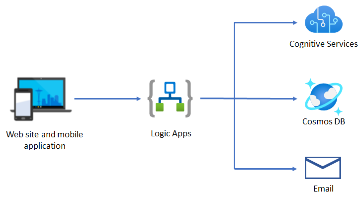

# チャレンジ 3 - Logic Apps

At Best For You Organics Company (BFYOC) では顧客満足度は最重要です。最高の商品を届けるためにも、BFYOC はカスタマーフィードバックを集めるシステムを構築したいと考えています。

現在 [Logic Apps](https://azure.microsoft.com/ja-jp/services/logic-apps/) を使ったワークフローで必要な処理が行えるか検討しています。



上の図はこのチャレンジ完了に必要な Azure サービスを示しています。

## チャレンジ

### HTTP トリガーの Logic App を作成

新しく HTTP トリガーの Logic App を作成します。以下のサンプルペイロードを使用して、入力要求を作成します。

* **HTTP Verb**: POST

* **入力ペイロードのサンプル**:

    ``` JSON
    {
        "userId": "cc20a6fb-a91f-4192-874d-132493685376",
        "productId": "4c25613a-a3c2-4ef3-8e02-9c335eb23204",
        "userFeedback": "This is my favorite one!"
    }
    ```

### ユーザーフィードバックの感情分析を行う

 `userFeedback` フィールドで提供されるユーザーのフィードバックについて感情分析を行い、0 ～ 1 の間の数値をスコアとします。1 に数値が近いほどポジティブな意見であり、0 に近いほどネガティブな意見であるとします。

* **Cognitive サービス**: Cognitive Services を使って感情分析を行います

* **感情分析**: `userFeedback` フィードの文章を Cognitive Services のテキスト分析アクションで解析します。

### フィードバックを Cosmos DB に保存

感情分析結果と共に、ユーザーフィードバックを前回のチャレンジで作成した Cosmos DB データベースに保存します。

* **パーティション キー**: `productId` 
* **フィードバックの例**:

    ``` JSON
    {
        "id": "abc0a6fb-a93e-4192-874d-132493612126",
        "productId": "4c25613a-a3c2-4ef3-8e02-9c335eb23204",
        "userId": "cc20a6fb-a91f-4192-874d-132493685376",
        "userFeedback": "This is my favorite one!",
        "score": "0.982596516609192"
    }
    ```

### フィードバックの結果をメールで通知

BFYOC では顧客満足度が低い場合、カスタマーサービス担当者にメールで通知したいと考えています。

* **条件分岐**: 感情分析の結果が `0.70` 以下の場合、Logic App から監視対象であるメールボックスに通知を送信
* **メール**: 任意の Email プロバイダーを利用 (例: Office 365, SendGrid または Gmail 等)
* **コンテンツ**: メール本文に感情分析のスコアをフィードバックを含める

## 達成条件

* [cURL](https://curl.haxx.se/) や [Postman](https://www.getpostman.com/) を使って Logic App を HTTP トリガーで起動
* ポジティブとネガティブ両方のフィードバックをテスト
* 感情分析のスコアが `.70` 以下の場合にメールが送信されることを確認
* Logic App の実行履歴より結果と内容を検証

## 参照情報

* [クイック スタート:Azure Logic Apps を使用して自動化されたワークフローを初めて作成する - Azure portal](https://docs.microsoft.com/ja-jp/azure/logic-apps/quickstart-create-first-logic-app-workflow)
* [チュートリアル:Azure Logic Apps を使用して承認ベースの自動化されたワークフローを作成する](https://docs.microsoft.com/ja-jp/azure/logic-apps/tutorial-process-mailing-list-subscriptions-workflow)
* [Azure Logic Apps のワークフロー アクションを制御する条件付きステートメントを作成する](https://docs.microsoft.com/ja-jp/azure/logic-apps/logic-apps-control-flow-conditional-statement)
* [感情の検出を追加する](https://docs.microsoft.com/ja-jp/azure/azure-functions/functions-twitter-email#add-sentiment-detection)

## 次のチャレンジ

Logic App が期待通りに動作したら、次のチャレンジである [API Management](..//Challenge-4-API-Management/readme.md) に進む。
