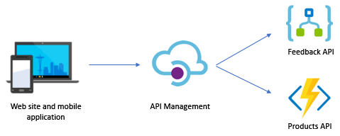

# Challenge 4 - API Management

Now that the APIs for Best For You Organics Company (BFYOC) are complete, it's time to make them public so that they can be called from their mobile and web applications. In the future, BFYOC might also want to share these APIs with their external partners.

## API Gateway Pattern

Rather than direct client-to-service communication, BFYOC would prefer to avoid the coupling that occurs between client applications and their backend services. In addition, they would like to address cross-cutting concerns such as authorization, logging and other considerations from a single location. Best For You Organics Company would like to introduce the [API Gateway pattern](https://docs.microsoft.com/en-us/dotnet/architecture/microservices/architect-microservice-container-applications/direct-client-to-microservice-communication-versus-the-api-gateway-pattern#what-is-the-api-gateway-pattern) as part of their solution.



The image above illustrates how [API Management](https://docs.microsoft.com/en-us/azure/api-management/) is leveraged as a gateway service to BFYOCs backend APIs.

## Challenge

### Create an API Management Instance

BFYOC would like for you to create a uniformly addressed version of their APIs. They would like to expose all their APIs under the same base URL, as they currently are under different base URLs.

Create a new instance of API Management that meets the following requirements:

* Hosted on the `Consumption` tier.
  * Please note that the Consumption tier is currently only available in a subset of Azure regions.
* Provide a unique name for the API Management service.

### Import the Products and Feedback APIs

* Import the Function App (Products) from [Challenge 2](..//Challenge-2-Cosmos-DB-and-Azure-Functions/readme.md) into the API Management service.
* Import the Logic App (Feedback) from [Challenge 3](..//Challenge-3-Logic-Apps/readme.md) into the API Management service.
* Test the APIs from within the Azure portal.

### Version the Feedback API and add Rate Limiting

BFYOC is concerned that the Feedback API might be called too frequently and would like to limit the number of times it can be invoked within a certain time frame. They would also like to add this new functionality under a new version of the API without having to make any changes to the Logic App. To achieve these goals, you will have to:

* Create a new version of the imported Feedback API (Logic App) and call it `v2`.
* Add a rate limit policy that will only allow the operation to be called 2 times within 10 seconds.
* Add the policy at the operation scope.

:bulb: Rate limiting by key isn't available in the Consumption tier of API Management. You will have to use the rate-limit policy instead:

``` XML
    <rate-limit calls="number" renewal-period="seconds" />
```

### Make the APIs Public

With API Management now in place as a facade to their backend APIs, it's time to make them publicly accessible for clients and other services to consume. BFYOC will like for you to make these APIs secure and available by doing the following:

* Create a `Product` on the API Management service that is publicly enabled and requires a subscription.
* Create a subscription for the recently created product. Each subscription will provide you with a set of keys.
* Associate the APIs with the product.

## Success Criteria

* Confirm that the API Management service is running on the Consumption tier.
* Call the APIs from [cURL](https://curl.haxx.se/) or [Postman](https://www.getpostman.com/) using a subscription key.
* Confirm that rate limiting is working on the `v2` version of the Logic App API.

## Bonus Challenge

### Add Cache Support

BFYOC does not anticipate their list of products changing frequently and would like to employ some caching on the Azure Functions that retrieve their product information. To make this happe, they are asking you to:

* Add caching support to the GET operations of the Products API.
* Cache the results for 60 seconds.

## References

* [Create a new Azure API Management service instance](https://docs.microsoft.com/en-us/azure/api-management/get-started-create-service-instance)
* [Import and publish your first API](https://docs.microsoft.com/en-us/azure/api-management/import-and-publish)
* [Publish multiple versions of your API](https://docs.microsoft.com/en-us/azure/api-management/api-management-get-started-publish-versions)
* [Azure API Management Consumption tier](https://azure.microsoft.com/en-ca/updates/azure-api-management-consumption-tier-is-now-generally-available/)
* [API Management access restriction policies](https://docs.microsoft.com/en-us/azure/api-management/api-management-access-restriction-policies#AccessRestrictionPolicies)
* [Subscriptions in API Management](https://docs.microsoft.com/en-us/azure/api-management/api-management-subscriptions)
* [API Gateway pattern](https://docs.microsoft.com/en-us/dotnet/architecture/microservices/architect-microservice-container-applications/direct-client-to-microservice-communication-versus-the-api-gateway-pattern)
* [Use an external cache](https://docs.microsoft.com/en-us/azure/api-management/api-management-howto-cache-external)
