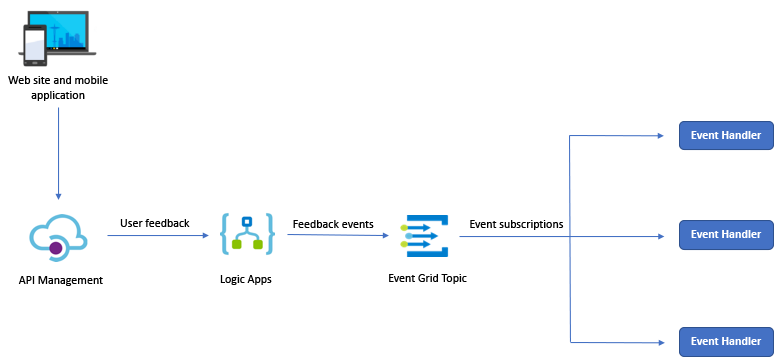

# チャレンジ 5 - Event Grid

Best For You Organics Company (BFYOC) は新 API の実装とフィードバックから得られるインサイトを非常に高く評価しています。評判は広まり、他の部署でもフィードバックを活用したいという意見が出てきました。

## 通知

BFYOC は組織内で商品のフィードバックを共有したいと考えています。どの程度のサービスがフィードバック情報を使うか見当がつかないため、[パブリッシャーとサブスクライバーのパターン](https://docs.microsoft.com/ja-jp/azure/architecture/patterns/publisher-subscriber) を利用して通知することにしました。



上の図は、[Azure Event Grid](https://azure.microsoft.com/ja-jp/services/event-grid/) を使って複数のサブスクライバーにパブリッシャーより情報を通知する様子を示しています。

## チャレンジ

### Event Grid トピックの作成

Event Grid のイベントソースは Blob ストレージや Azure Maps、リソースグループなど様々な Azure サービスが利用できます。このチャレンジではフィードバックを受信したタイミングでカスタムイベントを利用して通知を行います。そのため Event Grid トピックを以下の要件を満たすように作成します:

* 他サービスと同じ地域に Event Grid トピックを作成
* ユニークな名前を指定し、エンドポイントとキーの情報を後で利用するため取得

### イベントのパブリッシュ

BFYOC はフィードバックを受けるたびにイベントをパブリッシュします。その実現のため、[チャレンジ 3](..//Challenge-3-Logic-Apps/readme.md) で作成した Logic App から通知を送ります:

* Logic App に作成した Event Grid トピックにイベントを送るアクションを追加
* データペイロードを以下の例ように作成:

```JSON
{
    "Feedback": "customer feedback",
    "Score": "sentiment score",
    "Product": "product ID"
}
```

* `Event Time` プロパティには現在の UTC 時間を指定
* `ID` プロパティには新規に作成した GUID を指定
* `Subject` と `Event Type` プロパティは任意の文字を指定

### サブスクリプションの作成とイベントのハンドル

エンドツーエンドで機能することをテストするため、BFYOC は他のサービスでカスタムイベントを読み取る例を見たいと考えています。そのために以下を実施します:

* [Azure Event Grid のイベント ハンドラー](https://docs.microsoft.com/ja-jp/azure/event-grid/event-handlers) を確認
* Event Grid トピックのイベントハンドラーを選択。選択肢としては以下のようなものがある:
  * Event Grid でトリガーされる [Logic App](https://docs.microsoft.com/ja-jp/azure/event-grid/event-handlers#logic-apps)
  * Event Grid か HTTP でトリガーされる [Azure Function](https://docs.microsoft.com/ja-jp/azure/azure-functions/functions-bindings-event-grid) 
  * [Event Grid Viewer](https://github.com/Azure-Samples/azure-event-grid-viewer) を使って送信されたカスタムイベントを確認する

## 達成条件

* 新しいフィードバックを[チャレンジ 4](..//Challenge-4-API-Management/readme.md) で開発した外部 API に送信
* 上記で選択したハンドラーでイベントを受信できることを確認

## 参考情報

* [Azure Event Grid とは](https://docs.microsoft.com/ja-jp/azure/event-grid/overview)
* [Azure Event Grid の概念](https://docs.microsoft.com/ja-jp/azure/event-grid/concepts)
* [クイック スタート: Azure portal と Event Grid を使ったカスタム イベントの Web エンドポイントへのルーティング](https://docs.microsoft.com/ja-jp/azure/event-grid/custom-event-quickstart-portal)
* [クイック スタート: Azure CLI と Event Grid を使ったカスタム イベントの Web エンドポイントへのルーティング](https://docs.microsoft.com/ja-jp/azure/event-grid/custom-event-quickstart)
* [Azure Event Grid のイベント ハンドラー](https://docs.microsoft.com/ja-jp/azure/event-grid/event-handlers)
* [Event Grid Viewer (github)](https://github.com/Azure-Samples/azure-event-grid-viewer)
