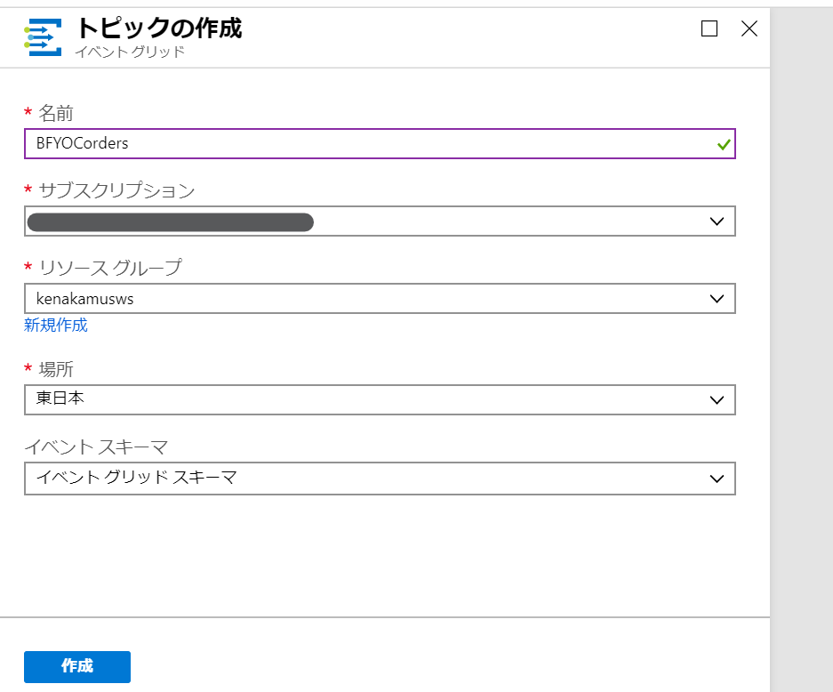
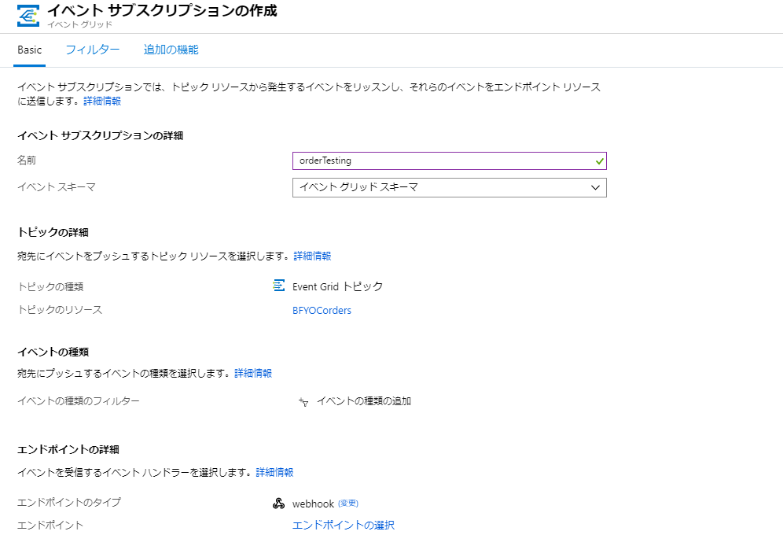

# モジュール 3 - イベント駆動

BFYOC はイベント駆動でマーケティングを最適化しようとしていて、注文が入るたびにカスタムイベントを発行するシステムが必要です。ここで開発するシステムは次のモジュールでも利用します。

このモジュールでは Azure Event Grid トピックを使って Azure のイベントを取得したり、カスタムイベントを発行するシステムを開発します。

## チャレンジ

アイスクリームの注文が入るたびに注文の内容を [Azure Event Grid のカスタム トピックに投稿する](https://docs.microsoft.com/ja-jp/azure/event-grid/post-to-custom-topic) Azure Function を開発します。

投稿されるトピックは以下の形式とします:

```json
[
  {
    "id": string,
    "eventType": "BFYOC.IceCream.Order",
    "subject": string,
    "eventTime": string-in-date-time-format,
    "data":{
        "orderId": string,
        "itemOrdered": string,
        "email": string
    },
    "dataVersion": string
  }
]
```

data のペイロードは注文のデータで、他はイベントのメタデータです。

関数に対してどのようにデータを渡してもいいですが、すでに開発した 2 つの関数同様 HTTP トリガーの関数に対して POST で渡すことを推奨します:

```
POST http://{myFunctionEndpoint}/api/iceCreamOrder
```

```json
{
  "orderId": "1",
  "itemOrdered": "52325",
  "email": "hello@contoso.com"
}
``` 

### Tips

1. まず [Event Grid のカスタム トピックの作成](https://docs.microsoft.com/ja-jp/azure/event-grid/scripts/event-grid-cli-create-custom-topic) を行う必要がある。
1. これまでやったモジュール同様、HTTP トリガーの関数を追加。
1. カスタムトピックを投稿する関数を開発したら、[カスタム トピックのイベントのサブスクライブ](https://docs.microsoft.com/ja-jp/azure/event-grid/scripts/event-grid-cli-subscribe-custom-topic) を使ってトピックをサブスクライブし、動作を確認。

### 詳細な手順

<details><summary>クリックして開く</summary><p>

1. Azure ポータルから名前を「BFYOCorders」として Event Grid Topic を作成。
  
  * トピックのエンドポイントとキーを後の手順のために保存しておく。

  アイスクリームの注文が入る度にカスタムイベントを送る先としてトピックを利用。注文に対して処理を行いたいプロセスはトピックをサブスクライブして処理するため、疎結合のシステムを開発できる。マーケティングやオペレーション、またマネージメントチームもトピックをサブスクライブして独自処理を行えるが、その際もイベント送信側は変更が不要。

1. 前回モジュールのプロジェクトを VSCode で開き、注文が入る度にカスタムイベントを作成する関数を開発する。
1. Azure Functions 拡張の「稲妻アイコン」をクリックして、新規関数を作成。
1. HTTP trigger を選択。
1. 名前を `iceCreamOrder`、承認レベルを `anonymous` として作成。
1. `iceCreamOrder` フォルダの `index.js` を以下のコードに変更:

  ```javascript
  var uuid = require('uuid').v4;
  var msRestAzure = require('ms-rest-azure');
  var eventGrid = require("azure-eventgrid");
  var url = require('url');

  module.exports = function (context, req) {
      context.log('New ice cream order made.');

      if (req.body) {
          // TODO: Enter value for topicKey
          let topicKey = '<aeg-sas-key>';
          // TODO: Enter value for topic-endpoint
          let topicEndPoint = '<topic-endpoint>';

          let topicCreds = new msRestAzure.TopicCredentials(topicKey);
          let egClient = new eventGrid(topicCreds);
          let topicUrl = url.parse(topicEndPoint, true);
          let topicHostName = topicUrl.host;
          let currentDate = new Date();

          let events = [
              {
                  id: uuid(),
                  subject: 'BFYOC/stores/serverlessWorkshop/orders',
                  dataVersion: '2.0',
                  eventType: 'BFYOC.IceCream.Order',
                  data: req.body,
                  eventTime: currentDate
              }
          ];
          egClient.publishEvents(topicHostName, events).then((result) => {
              return Promise.resolve(console.log('Published events successfully.'));
          }).catch((err) => {
              console.log('An error ocurred ' + err);
          });
      }
      else {
          context.res = {
              status: 400,
              body: "Please pass an ice cream order in the request body"
          };
      }
      context.done();
  };
  ```

  `<topic-endpoint>` と `<aeg-sas-key>` を手元の環境の値に入れ替え。  

  ここでは HTTP 要求のボディからデータのペイロードを作成。SAS キーとエンドポイントを利用して、Event Grid トピックにカスタムイベントを追加している。

1. ターミナルより iceCreamOrder フォルダに移動後、依存環境のインストール:

```
cd iceCreamOrder
npm install uuid@3.3.2 ms-rest-azure@2.6.0 azure-eventgrid@1.6.0 url@0.11.0 --save
```

1. `function.json` の中身を変更して、バインディングから GET を削除:

    ```json
    {
      "disabled": false,
      "bindings": [
        {
          "authLevel": "anonymous",
          "type": "httpTrigger",
          "direction": "in",
          "name": "req",
          "methods": [
            "post"
          ]
        },
        {
          "type": "http",
          "direction": "out",
          "name": "res"
        }
      ]
    }
    ```

  これにより、意図したとおり POST のみを受け付けるようになる。

  コードはこれで全てのため、次にテストを実行。

1. 以下のボタンより Event Grid Viewer web アプリを作成。

    <a href="https://portal.azure.com/#create/Microsoft.Template/uri/https%3A%2F%2Fraw.githubusercontent.com%2FAzure-Samples%2Fazure-event-grid-viewer%2Fmaster%2Fazuredeploy.json" target="_blank"></a>

1. 作成された Web サイト `https://<your-site-name>.azurewebsites.net` に移動。

  

1. 注文がリアルタイムに流れる様子を見るために、Azure ポータルを開き、作成した Event Grid トピックを開く。新規にトピックに対して「イベント サブスクリプション」をクリック。名前を `orderTesting`、エンドポイントのタイプで **Web Hook** を指定し、サブスクライバーのエンドポイントとして、ビューワーである `https://<your-site-name>.azurewebsites.net/api/updates` を指定。

  * サブスクリプションが作成されると「Subscription Validation Event」が表示されるが、これは [Event Grid のセキュリティと認証](https://docs.microsoft.com/ja-jp/azure/event-grid/security-authentication)の一環。これにより他の作業をしなくてもデータを見ることができる。

  

1. VSCode にて **デバッグ** より **デバッグの開始** をクリック。

    ランタイム実行時に、これまでの URL に加え、以下アドレスが表示される:

    > Http Functions:
    > iceCreamOrder: http://localhost:7071/api/iceCreamOrder

1. Postman を開き、以下ドキュメントを作成。  
    1. `POST` 要求を `http://localhost:7071/api/iceCreamOrder` に向けて作成。
    1.  **Body** で **raw** を選択し、**JSON (application/json)** を指定。
    1. 以下の JSON を追加:

    ```json
    {
      "orderId": "1",
      "itemOrdered": "52325",
      "email": "hello@contoso.com"
    }
    ```  
1. 要求を送信し、ステータスコード 200 を受信。イベントビューワーを見るとイベントが表示される。
1. 他の注文も送信:
    ```json
    {
      "orderId": "2",
      "itemOrdered": "88295",
      "email": "hello@contoso.com"
    }
    ```

1. これでトピックの作成と動作確認が完了。必要に応じて後続処理を行うプログラムでイベントのサブスクリプションを作成可能。

  最後に開発した関数を公開。

1. デバッグ停止後、Azure Functions 拡張機能より、「上矢印アイコン」をクリックして発行。
1. 現在のフォルダをソースに、モジュール 1 で作成した関数アプリをターゲットに公開。
    1. 画面右下に更新中のインジケーターが表示される。
1. Azure ポータルで公開した関数を開き、URL を確認。公開済のアプリも同様に動作することを確認。

</p></details>

## ボーナス

BFYOC　は頻繁にアイスクリームのメニュー更新していて、フランチャイズでもその情報をリアルタイムに取得する必要があります。新しいフレーバーが追加されるたびに Cosmos DBを更新する必要があります。また BFYOC は商品情報について、より詳細な説明と写真も提供していますが、これらは別々のファイルになっています。

### 前提条件

* モジュール 2 が完了していて、Cosmos DB が起動している。コードが手元にない場合は answer フォルダのコードを参照。

### ボーナスチャレンジ

これまでは Cosmos DB に対して POST を受け付ける関数を 1 提供していました。しかし現在は商品の情報に加え、詳細情報と写真が追加されており、これらすべて揃うまで商品情報を公開したくありません。そこで V2 のストレージアカウントかブロブストレージを作成し、商品に関わる全ての情報をアップロードしてもらい、すべての 3 の情報が揃った際に、すべての情報をまとめた以下のようなデータを Cosmos DB に情報を追加することにします。

```json
{
    "id": "081517EG",
    "flavor": "Wonder Blast",
    "price-per-scoop": 0.60,
    "photo-url": "https://example.blob.core.windows.net/examplecontainer/081517EG-photo.png",
    "description": " Topping biscuit cookie chocolate bar lemon drops oat cake gummies jelly. Chocolate cake donut chocolate cupcake. Wafer gingerbread croissant liquorice tootsie roll. Cake lemon drops jujubes jujubes chocolate jelly beans marzipan fruitcake oat cake. Sweet roll tiramisu topping. Cheesecake tootsie roll icing fruitcake sesame snaps bonbon jelly-o biscuit."
}
```

ファイルの関連を明確にするために、すべてのファイルには プロダクト ID が付与されます。

* 商品データ: Product ID、フレーバー、値段が含まれた JSON データ。ファイル名は `081517EG-data.json` のようになる。
* 商品の詳細な説明: 商品の詳細な情報を含めたテキストファイル。ファイル名は `081517EG-description.txt` のようになる。
* 商品の写真: ファイル名は `081517EG-photo.png` のようになる。

`supporting-files` フォルダにサンプルデータを 2 つ用意しました。

### Tips

1. イベントグリッドでは `Microsoft.Storage.BlobCreated` イベントをサブスクライブできる。[こちらのクイックスタート](https://docs.microsoft.com/ja-jp/azure/event-grid/blob-event-quickstart-portal)を参照。
1. 以下のボタンをクリックしてビューワーを作成できる。

    <a href="https://portal.azure.com/#create/Microsoft.Template/uri/https%3A%2F%2Fraw.githubusercontent.com%2FAzure-Samples%2Fazure-event-grid-viewer%2Fmaster%2Fazuredeploy.json" target="_blank"></a>

    * イベントサブスクリプションのエンドポイントとして、`https://<your-site-name>.azurewebsites.net/api/updates` を登録。
    * Web サイトでデータのフローが確認可能 `https://<your-site-name>.azurewebsites.net`

    
1. [Durable Functions](https://docs.microsoft.com/ja-jp/azure/azure-functions/durable-functions-overview) を使うとステートフルな関数を作成できる。これは 3 つのファイルが揃うまで待つような場合に有効な手段となる。

1. 他のモジュール同様、複数の方法で目的を達成することが可能:

 * Durable functions と suborchestrator インスタンスを使って、すべてのファイルを待機する
 * 通常の関数を使ってすべてのそれぞれのファイルをアップロードし、都度 3 つのファイルが揃っているか確認する
 * ロジックアップを利用する
 * 全てのファイルを Cosmos DB に追加して、別プロセスで 3 つのファイルが揃っているか定期的に確認する
 * などなど


## ドキュメント

* [Azure Event Grid とは](https://docs.microsoft.com/ja-jp/azure/event-grid/overview)
* [クイック スタート: Azure portal で Blob Storage のイベントを Web エンドポイントにルーティングする](https://docs.microsoft.com/ja-jp/azure/event-grid/blob-event-quickstart-portal)
* [クイック スタート: Azure portal と Event Grid を使ったカスタム イベントの Web エンドポイントへのルーティング](https://docs.microsoft.com/ja-jp/azure/event-grid/custom-event-quickstart-portal)
* [HTTP エンドポイントへのイベントの受信](https://docs.microsoft.com/ja-jp/azure/event-grid/receive-events)
* [Azure Event Grid のイベント ソース](https://docs.microsoft.com/ja-jp/azure/event-grid/event-sources)
* [Azure Event Grid のイベント ハンドラー](https://docs.microsoft.com/ja-jp/azure/event-grid/event-handlers)
