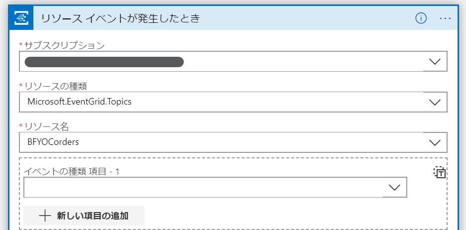
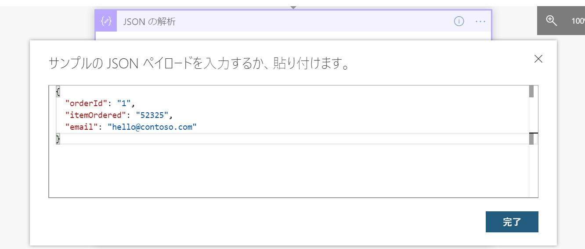
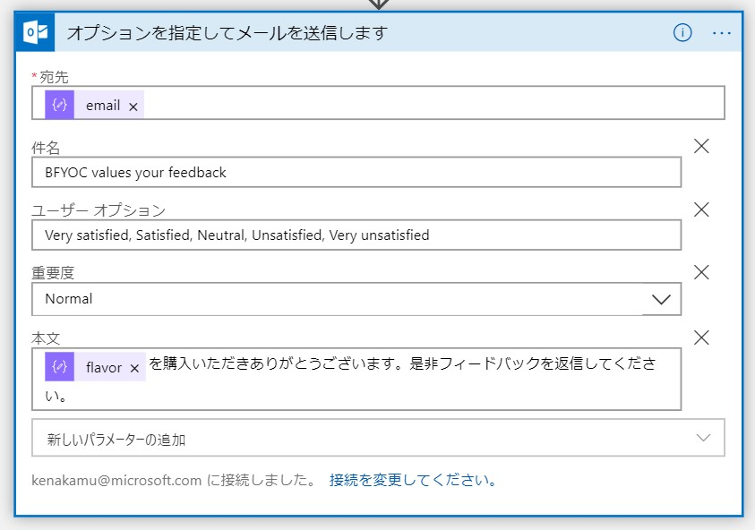
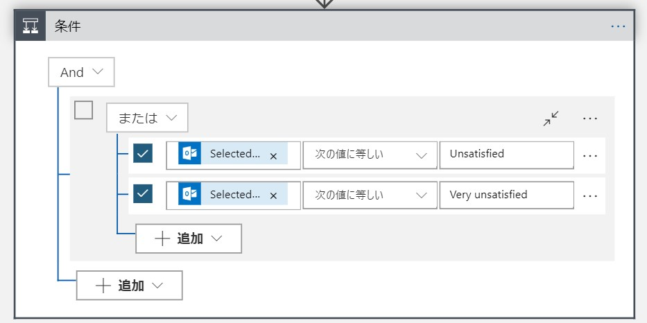

# モジュール 4 - Logic Apps

BFYOC にとって顧客満足度は最重要指標です。そのため BFYOC は商品購入後の顧客に対するアンケートシステムを構築することにしました。

このモジュールでは Logic Apps をワークフローエンジンとして利用して、複数システムを統合します。

## 前提条件

* Windows 10、 Mac OS X、 Mac OS X 10.12 以上が動作する PC
* [Azure ポータル](https://portal.azure.com) に接続するブラウザー
* Office 365 Outlook か Outlook.com のメールアドレス
* モジュール 1、2、3 を完了していること

## チャレンジ

モジュール 3 で開発したイベントグリッド トピックに対してカスタムイベントが作成されたことをトリガーに実行される Logic App を作成します。

```json
{
  "orderId": "1",
  "itemOrdered": "52325",
  "email": "hello@contoso.com"
}
```

イベントを受信したら `itemOrdered` プロパティの値を使って、Cosmos DB から商品情報を取得します。その後異なるオプション (`Very satisfied`, `Satisfied`, `Neutral`, `Unsatisfied`, `Very unsatisfied`) をユーザーに送信し、ユーザーのレスポンスを Cosmos DB に登録します。

### Tips

1. まず [Azure ポータル](https://portal.azure.com) にログインできることを確認。
1. Office 365 Outlook も Outlook.com もない場合は、[無償で Outlook.com アカウントを作成](https://outlook.live.com/)。
1. モジュール 3 を完了していない場合、イベントグリッドのトピックではなく、**Request** トリガーを使うことも可能。
1. カスタマーフィードバックを格納する Cosmos DB コレクションをモジュール 2 で作成した Cosmos DB に作成。

### 詳細な手順

<details><summary>クリックして開く</summary><p>
  
1. [Azure ポータル](https://portal.azure.com) を開く。
1. Azure ポータルから Cloud Shell を開く。
1. Cloud Shell 上 (Bash/PowerShell 何れも可) で下記のコマンドを実行し、モジュール 2 で作成した Cosmos DB に `reviews` コレクションを作成する。
```
az cosmosdb sql container create --resource-group $RESOURCE_GROUP --account-name $ACCOUNT_NAME --database-name icecream --name reviews
```
4. Logic App を作成する。
1. 作成した Logic App を開き、テンプレートより **空のロジックアプリ** を選択。
1. トリガーで `Azure Event Grid` を検索して選択し、`リソースイベントが発生したとき` を選択。
1. Azure ポータルにサインインしているアカウントでサインインを実行。
1. **サブスクリプション** を選択。 **リソースの種類** は `Microsoft.EventGrid.Topics` を選択し、作成済のリソース名を選択。

1. いったん「保存」してから、モジュール 3 で作成した API を呼び出してトピックにカスタムイベントを追加。
```
POST http://{myFunctionEndpoint}/api/iceCreamOrder
```
10. デザイナーを右上の [x] で閉じて、「最新の情報に更新」をクリック。構成が正しく行われていれば実行結果が表示される。

1. トリガーされていることを確認したら、**編集** ボタンからエディターに戻る。**新しいステップ** より `JSON の解析` を検索して追加。
1. **コンテンツ**には動的なオブジェクトより、`データオブジェクト` を選択。
1. **サンプルのペイロードを使用してスキーマを生成する** リンクをクリックして、以下 JSON を張り付け。**完了**をクリック。
```json
{
  "orderId": "1",
  "itemOrdered": "52325",
  "email": "hello@contoso.com"
}
```


14. **新しいステップ** より `Cosmos Db` を検索して、`1 つのドキュメントを取得する` を選択。任意の接続名を入力いれ、一覧よりモジュール 2 で作成した Cosmos DB を選択して **作成** をクリック。
1. **データベース ID**　で `icecream`、**コレクション ID** で `products` を選択。**ドキュメント ID** で動的なコンテンツより `itemOrdered` を選択。
1. `JSON の解析` を次のアクションに追加して、ドキュメントの `本文` を **コンテンツ**に追加。以下のペイロードでスキーマを作成。
```json
{
  "id": "1",
  "flavor": "Rainbow Road",
  "price-per-scoop": 3.99
}
```
17. **新しいステップ** より Office 365 Outlook か Outlook.com の `オプションを指定してメールを送信します` アクションを追加。必要に応じてサインインを実行。
1. **宛先** を動的コンテンツより、最初の JSON 解析結果より `email`　を選択。**件名**に `BFYOC values your feedback` を入力。 **ユーザーオプション**に `Very satisfied, Satisfied, Neutral, Unsatisfied, Very unsatisfied` を入力し、本文は適当に入力。

1. ユーザーから返信があると、その結果が取得できます。**新しいステップ** より `Cosmos DB` を検索し、`ドキュメントを作成または更新する` を選択。
1. **データベース ID** で `icecream`、**コレクション ID** に `reviews` を入れます。また**ドキュメント**に動的オブジェクトを駆使して以下のデータを設定します.
```json
{
  "id": "[Use expression editor to insert guid() expression]",
  "review": "[Selected option token]"
}
```

### 次のアクション
顧客のフィードバックを受け取った後に何をするかは自由です。クーポンを送るなり、チームメンバーに通知するなり考えてみてください。Logic App がサポートする [200 以上のコネクタ](https://docs.microsoft.com/ja-jp/connectors/) を見えてヒントを得ましょう！

例えば、`条件` アクションを使うと **Unsatisfied** と **Very unsatisfied** を選んだ時に実行するアクションを分けたりもできます。
. **true の場合** に電子メールをチームに送るなどアクションを追加します。
 
</p></details>
<!-- markdownlint-disable MD032 MD033 -->

## ドキュメント

* [クイック スタート:Azure Logic Apps を使用して自動化されたワークフローを初めて作成する - Azure portal](https://docs.microsoft.com/ja-jp/azure/logic-apps/quickstart-create-first-logic-app-workflow)
* [Azure Logic Apps でメーリング リスト要求を管理する](https://docs.microsoft.com/ja-jp/azure/logic-apps/tutorial-process-mailing-list-subscriptions-workflow)
* [Azure Logic Apps で次のアクションの実行を遅延させる](https://docs.microsoft.com/ja-jp/azure/connectors/connectors-native-delay)
