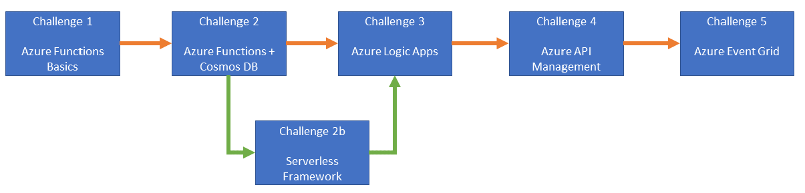

# サーバーレス ワークショップ

## 概要
サーバーレスで開発をするということは、サーバー管理を気にせず、開発に集中できる環境が手に入るということです。アプリケーションをサポートするためのインフラを気にする必要も、サポートする必要もありません。サーバーレスでは、開発者はビジネスロジックとアプリがもたらすイノベーションに集中することができ、また公開までの時間もずっと短縮できます。

このワークショップはチャレンジベースとなっていて、一日で Azure 上でサーバーレスソリューションをデザインして実装する手法が学べるようにデザインされています。Azure Functions の実装と公開、Logic Apps を使って他サービスと統合するワークフローの実装、またそれらの API を管理するための API Management の構築や、イベント駆動ソリューションを実装するための Event Grid の使い方を学びます。

その他、サーバーレスフレームワークを使って数行でサーバーレスにマイグレーションを行うテクニックも学べます。

開発者は、コードとロジックおよび想像力だけがあればよく、サーバーレスプラットフォームがその他全てを担当してくれます。

## ワークショップの対象者

このイベントはソフトウェアエンジニアおよび開発者を対象としていますが、Azure とサーバーレステクノロジーに興味がればどなたでも参加可能です。前提条件を確認して環境を準備してください。また、特にサーバーレスアーキテクチャを採用する予定のある組織や、ビジネスプロセスの自動化を検討している方々にメリットが多くあります。

## ワークショップで登場する企業について

本ワークショップでは、あなたは以下に説明のある企業の技術者という設定です。アプリケーションの背景を把握するため、内容をしっかりと読んだください。

**Best For You Organics Company (BFYOC)** は全世界で 200 以上のアイスクリーム店を展開する企業です。 BFYOC は地元で採れた、旬で新鮮な素材にこだわった 26 種類のアイスクリームを作っており、フレーバーは一般的なバニラ味から、大人気のアボカドトースト（名前の印象と違ってとても美味しい) まで幅広く取り揃えています。現在は新しくフルーツ味の商品ラインナップを開発中です。

プレミアムな材料を売りにしている一方、購入しやすい値段を設定しているため、利益はあまり出ません。そのため、お客様が商品購入後ハッピーである事と同時に、セールスプロセスを最適化する必要があります。コストを極力抑える必要があるため、テクノロジーに使える予算もあまりありません。

BFYOC は顧客満足度とセールスを分析するために、新しくフィードバックツール導入しようと思っています。フィードバックの量はその時々で変わるため、自動でスケールしてコストを最適化するようなソリューションを探しています。

また、在庫と発注プロセスを最適化してコストを下げるとともに、過剰商品の破棄を避けたいと思っています。そのため、販売業者に新商品の情報を通知した際、在庫に合わせて自動で発注ができるシステムが必要です。

## チャレンジ

[次の数時間で](./agenda.md)、Azure 上のサーバレスコンポーネントを駆使して BFYOC の新しいカスタマーフィードバックシステムのキーとなる API を開発します。

| チャレンジ                      | 説明       |
|--------------------------------|-------------------|
| Azure Function の基礎 | HTTP トリガーで実行される Azure Function の作成とデプロイ |
| Cosmos DB と Azure Functions | HTTP トリガーで実行される Azure Function で Cosmos DB アウトプットバインディングを使用したデータの書き込み |
| Logic Apps | HTTP POST として送信されるユーザーフィードバックを受信し、文章から感情分析を実施した後 Cosmos DB に保存。また評価の低いフィードバックに関してメールを送信する Logic App ワークフローの作成 |
| API Management | API Management を使った統一的な API エンドポイントの公開およびバージョン管理、スロットリングの実施 |
| Event Grid | Event Grid を使ってカスタマーフィードバックを複数のサブスクライバーの公開  |
| サーバーレスフレームワーク | Azure のサーバレスフレームワークプラグインを利用して、HTTP トリガーで Cosmos DB にデータを保存する　Azure Function の代替えアプローチの模索 |

### チャレンジの工程

以下の図はチャレンジの工程を示しています。全てのチャレンジを順番に実施することもできますし、サーバーレスフレームワークチャレンジ (チャレンジ 2b) を Azure Functions (チャレンジ 2) の後に実施して、その後チャレンジ 3 に進むこともできます。チャレンジ 2b は 2 と似ていますが、異なるアプローチを模索するチャレンジであるため、余裕があれば少し寄り道をして知見を広げてみてください。

## 次のステップ

準備ができたら、はじめのチャレンジである [Azure Function の作成とデプロイ](./Challenge-1-Azure-Function-Basics/readme.md) に進んでください。
